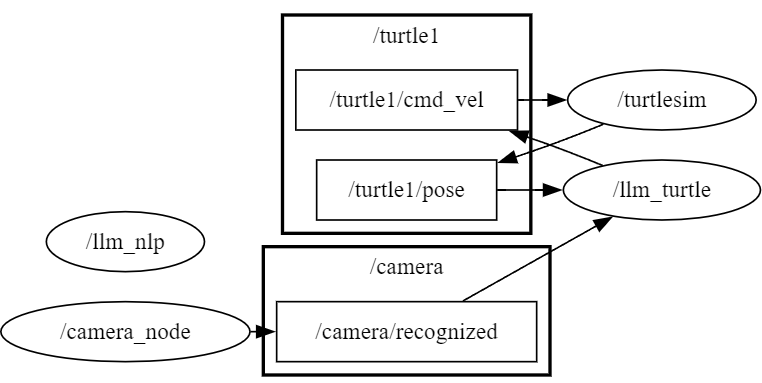
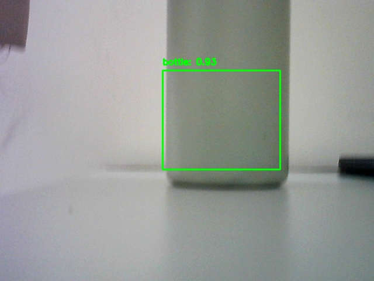

# sim_llm
  
### 介绍
  
该分支基于 ROS1 实现   
  
#### 任务逻辑
主体任务逻辑分三个 `node` 完成：
  
- `llm_nlp node` ：自然语言处理节点。接收用户输入，调用 DeepSeek api ，通过给 AI 合适的 prompt 将自然语言转换为 Json 字符串，并将其作为服务请求发送到 `/trans`。
    - 有一点需要说明的是，我创建了 `my_interfaces` 包用来规定服务请求的数据类型。
  
- `llm_run node` ：控制节点。订阅 `turtle1` 节点发布的 `turtle1/pose` 位置信息，订阅 `camera` 节点发布的 `/camera/recognized` 识别的目标信息，创建 publisher 发布到 `/turtle1/cmd_vel` 控制 turtle 移动。用于控制 turtle 执行巡逻任务，并通过相机识别目标。如果在巡逻过程中识别到目标，立即记录当前位置并打印信息。采用多线程处理巡逻任务和命令请求以及基本信息获取，确保各个功能之间不会互相影响，达到实时响应。
  
- `camera node` ：识别节点。从摄像头捕获图像，使用 Roboflow 模型进行物体检测，然后将检测结果发布到 `/camera/recognized`。为了缓解识别图像造成的卡顿掉帧，通过多线程处理捕获操作和帧操作，同时也可以避免阻塞定时器的回调任务。
  

  
  
#### 目录结构
```
sim_llm/
├── src/
│   ├── llm_robot/
│   │   ├── llm_robot/               核心代码
│   │   ├── resource/
│   │   └── roboflow/                本地基于yolov8n训练的模型，但是很奇怪效果没有调用 roboflow 的 api 好，可能是由于电脑太老了跑不动。
│   │       ├── runs/detect/train/
│   │       ├── test/                
│   │       │   └── images
│   │       │   └── labels
│   │       ├── train/
│   │       │   └── images
│   │       │   └── labels
│   │       └── valid/
│   │           └── images
│   │           └── labels
│   └── my_interfaces/              自定义的接口
│       └── srv/
└── assets/                         README.md 中用到的一些素材
```
  
### 部署
  
#### 先决条件
0. 我的工作环境（不确保能否在其他环境下正常运行）
  
```
Ubuntu VERSION == 20.04.6 LTS
ROS DISTRO == noetic
python3 version == 3.8.10
catkin version == 0.9.4
```
  
1. clone该项目的ROS1分支
  
```bash
git clone -b ROS1 https://github.com/lalafua/sim_llm.git
cd sim_llm/
```
  
2. 安装python包
    - 我使用 `pip freeze` 导出的 `requirements.txt` ，因此有些包是多余的，但是导出的包太多了就没有一个一个查
  
```bash
python3 -m venv .venv/
source .venv/bin/activate
pip install -r requirements.txt
```

3. 设置环境变量

```bash
export SILICONFLOW_API_KEY = "<your SiliconFlow api key>"
export ROBOFLOW_API_KEY = "<your RoboFlow api key>"
``` 
SiliconFlow: https://siliconflow.cn/
RoboFLow: https://roboflow.com/

4. 编译工程文件
  
```bash
catkin_make
```
  
#### 运行
  
打开四个终端
分别运行
  
```bash
source devel/setup.bash
rosrun llm_robot llm_nlp
```
```bash
source devel/setup.bash
rosrun llm_robot llm_run
```
```bash
source devel/setup.bash
rosrun llm_robot camera
```
```bash
source devel/setup.bash
rosrun turtlesim turtlesim_node
```
  
其中， `llm_nlp` 节点会在服务就绪后提示输入 `command` ，输入 `find the bottle` 后，就可以看到 turtle 正在寻找 bottle 了（其他指令还没有写，目前只有这一个，不过可以自己训练想要识别的目标）

识别完成之后，识别到物体的帧会以 `{class_name}_{timestamp}.jpg` 的命名方式保存在 `run/` 目录下。


  
  
  