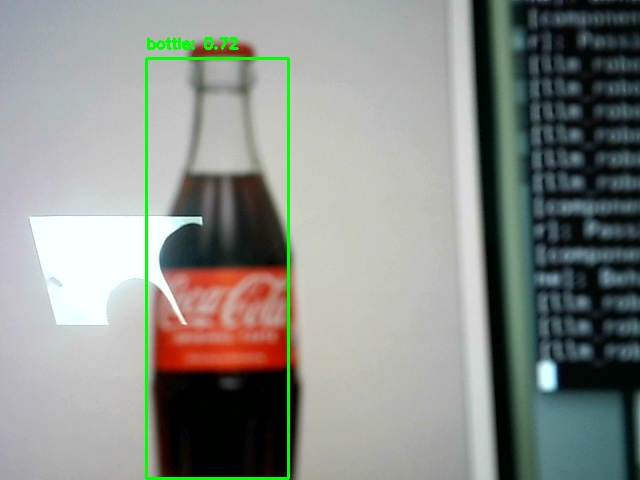

# sim_llm
  
## 介绍
  
此仓库基于 ROS2 Humble 开发，原 ROS1 分支可以在新开的仓库查看： [sim_llm_ROS1](https://github.com/lalafua/sim_llm_ROS1)

相较于 ROS1 Noetic 上的实现，该分支做了如下改动：
- urdf 建模替换，帮助调试 TF Tree
- 建图算法使用 Cartographer （ ROS1 为 gmapping ）
- 导航框架使用 Nav2（ ROS1 为 map_server 和 move_base ）

改动主要是适配 ROS1 -> ROS2 的功能包切换升级，顶层控制逻辑并没有改变

### Demo


### 顶层逻辑

顶层任务逻辑分三个 `node` 完成：
  
- `llm_nlp node` ：自然语言处理节点。接收用户输入，调用 SiliconFlow api ，通过给 AI 合适的 prompt 将自然语言转换为 Json 字符串，并将其作为服务请求发送到 `/llm_nlp/cmd` 服务。

- `camera node` ：识别节点。从摄像头捕获图像，使用 Roboflow 模型进行物体检测，然后将检测结果发布到 `/camera/recognized`。为了缓解识别图像造成的卡顿掉帧，通过多线程处理捕获操作和帧操作，同时也可以避免阻塞定时器的回调任务。

- `llm_robot node` ：控制节点。通过 TF Tree ：`map -> base_footprint` 的变换关系，获得机器人的实时坐标；订阅 `camera` 节点发布的 `/camera/recognized` 识别的目标信息；使用 `nav2_simple_commander.robot_navigator` 的 `BasicNavigator` 类，执行简单的导航任务。
  
### 参考
- TF2
    - [ROS2 Humble TF2 文档](https://docs.ros.org/en/humble/Tutorials/Intermediate/Tf2/Tf2-Main.html)
    - [Geometry2 仓库](https://github.com/ros2/geometry2)
    - [ROS2 workshop TF2 文档](https://ros2-industrial-workshop.readthedocs.io/en/latest/_source/navigation/ROS2-TF2.html)
- Navigation2
    - [Nav2 官方文档](https://docs.nav2.org/)
    - [Nav2 ROS2 仓库](https://github.com/ros-navigation/navigation2)
    - [ROS2 workshop Navigation2 文档](https://ros2-industrial-workshop.readthedocs.io/en/latest/_source/navigation/ROS2-Navigation.html)
- Cartographer
    - [Cartographer ROS2 仓库](https://github.com/ros2/cartographer_ros)
    - [ROS2 workshop Cartographer 文档](https://ros2-industrial-workshop.readthedocs.io/en/latest/_source/navigation/ROS2-Cartographer.html)
- [鱼香ROS](https://fishros.com/d2lros2/)
- [ROS2 Cookbook](https://fer.gs/ros2_cookbook/)
- Gemini2.0 Flash Thinking

## 部署
  
### 先决条件
0. 我的开发环境
  
    ```
    ==============================
    ROS2 Development Environment 
    ==============================
    OS Info: Linux ubuntu2204 6.8.0-52-generic #53~22.04.1-Ubuntu SMP PREEMPT_DYNAMIC Wed Jan 15 19:18:46 UTC 2 x86_64 x86_64 x86_64 GNU/Linux
    Python Version: Python 3.10.12
    Gcc Version: gcc (Ubuntu 11.4.0-1ubuntu1~22.04) 11.4.0
    CMake Version:cmake version 3.22.1
    ROS Distro: humble
    =============================
    ```
    你应该还要准备一个摄像头
  
1. clone 该项目
    
    ```bash
    git clone https://github.com/lalafua/sim_llm.git
    cd sim_llm/
    ```
  
2. 安装 python 依赖
    
    ```bash
    pip install -r requirements.txt
    ```

3. 设置环境变量

    打开 .bashrc , 在最后添加：
    ```bash
    export SILICONFLOW_API_KEY = "<your SiliconFlow api key>"
    ``` 
    - 注：也可以替换为其他大模型供应商的 API , 最好支持 openai 的 API 调用方式

4. 编译工程文件
  
    ```bash
    colcon build --symlink-install
    ```
  
### 运行
  
打开两个终端
分别运行
  
```bash
source install/setup.bash
ros2 run llm_robot llm_nlp
```
```bash
source install/setup.bash
ros2 launch llm_robot llm_robot.launch.py
```
  
其中， `llm_nlp` 节点会在服务就绪后提示输入 `command` ，输入 `find my Coke` 后，就可以看到机器人正在寻找 bottle 了（其他指令还没有写，目前只有这一个，不过可以自己训练想要识别的目标）

识别到目标之后，识别到物体的帧会以 `{class_name}_{timestamp}.jpg` 的命名方式保存在 `run/` 目录下，然后机器人会返回原点，在成功完成任务之后会打印出识别到目标时的位置。


  
## 二次开发

得益于 ROS2 优秀的设计架构和技术，我们可以很轻松的在此项目的基础上进行二次开发。

在本项目中
- `llm_robot` 为项目的顶层包
    - llm_nlp.py 中包含用于引导 AI 解析自然语言的 Prompt 
    - llm_robot.py 提供了最高抽象的控制逻辑，如果想要修改机器人的行为逻辑可以从此入手

- `my_interfaces` 定义了一组接口，用于 node 之间的请求传递

- `robot_description` 有以下几个功能：
    - robot_spawn.launch.py 启动 gazebo 加载地图场景文件并通过启动 qpbot.launch.py 的方式加载机器人
    - cartographer.launch.py 启动建图任务，因此只在初期会用到

- `robot_navigation2` 用于载入 cartographer 创建的地图文件并启动导航服务器


