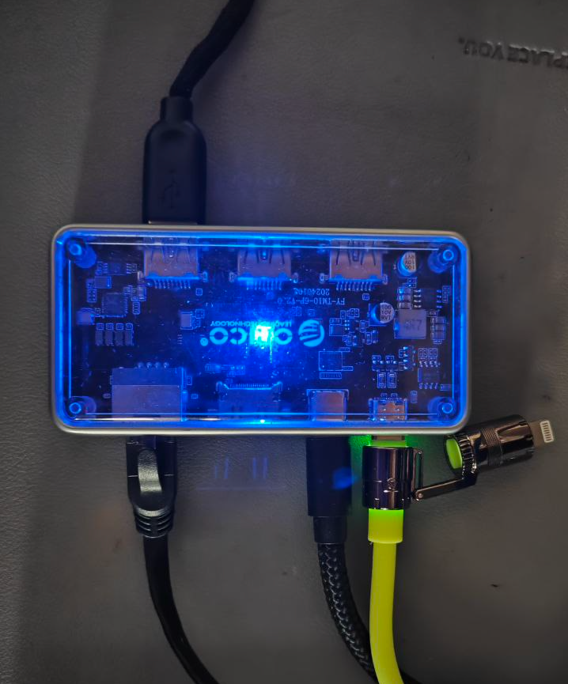
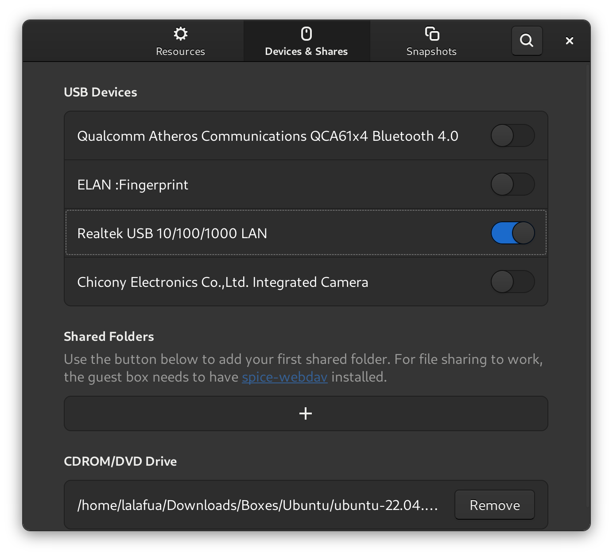
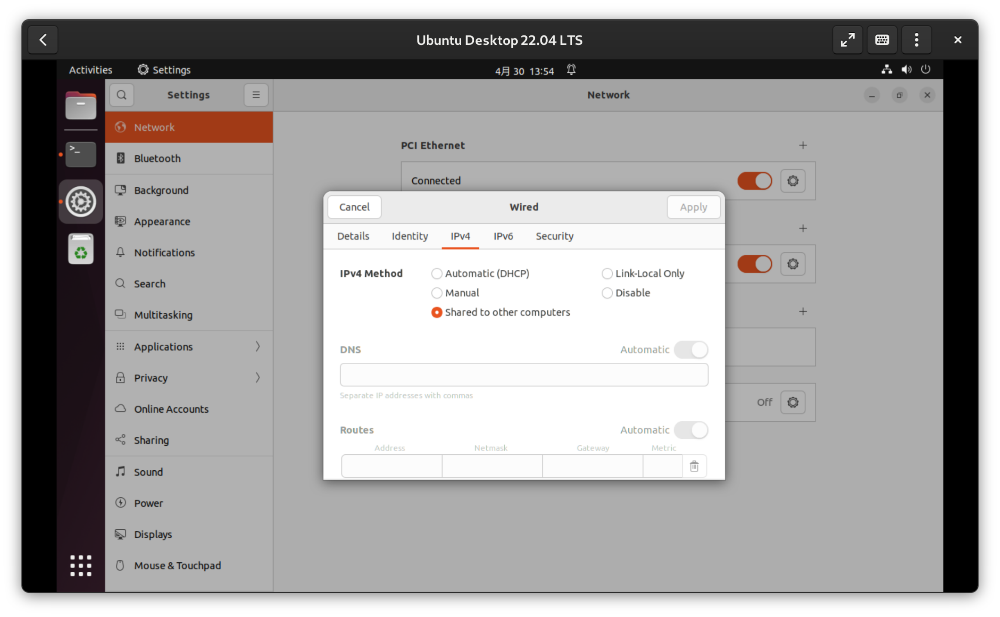
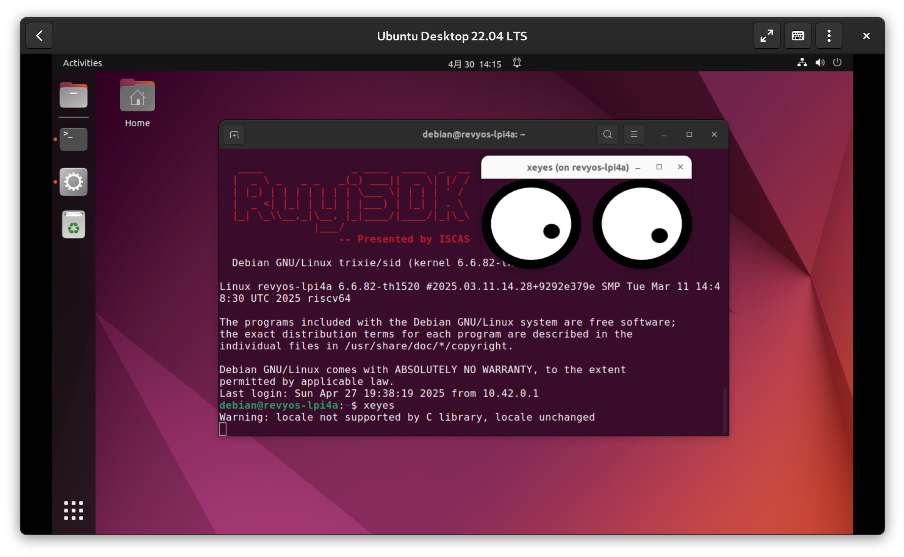
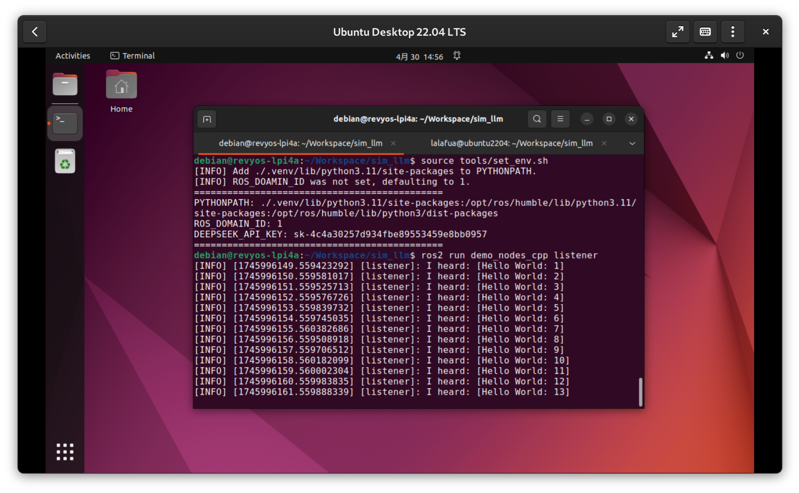
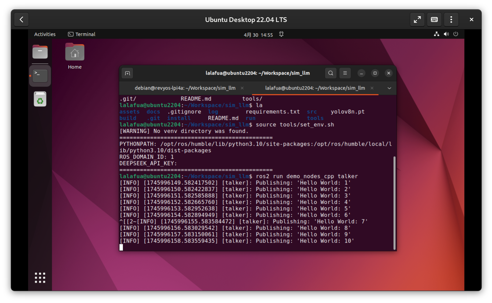
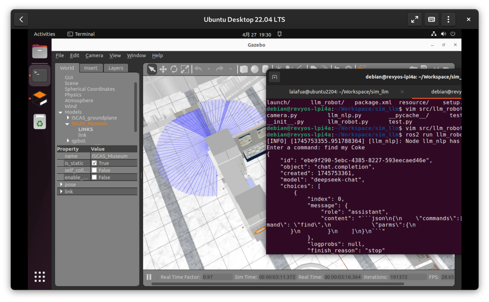

# Multiple Mechine

受限于 Linux 开发板较弱的性能和 Riscv 并不完善的生态环境，我选择用多机通信的方式来完整的运行此 demo 。得益于 ROS2 优秀的分布式系统设计，我们可以将需要大量运算资源的 node （比如仿真环境，路径规划等任务）放在 x86 主机上运行，而所需运算资源较少的 node （比如）放在开发板上运行。

## 连接

我使用的操作系统是 Fedora 42 ，为了减少不必要的麻烦，我用 gnome-boxes 创建 ubuntu 22 虚拟机作为 ROS2 的主机。

1. 待开发板开机之后，通过拓展坞上的网口建立主机与开发板之间的网络连接
    

2. 在虚拟机的设置中将 USB 网络设备接入虚拟机
    

3. 接入之后在 Settings -> Network -> USB Ethernet -> Settings 中将 IPv4 和 IPv6 的 Method 设置为 Shared to other computers ，这样做可以让开发板从主机这里获得互联网连接
    

4. 此时用 `ip addr show` 可以看到一个以 enx 开头的网卡设备
    ```shell
    enxf01e3416a7ba: <BROADCAST,MULTICAST,UP,LOWER_UP> mtu 1500 qdisc fq_codel state UP group default qlen 1000
    link/ether f0:1e:34:16:a7:ba brd ff:ff:ff:ff:ff:ff
    inet 10.42.0.1/24 brd 10.42.0.255 scope global noprefixroute enxf01e3416a7ba
       valid_lft forever preferred_lft forever
    inet6 fe80::b8b6:7abc:654d:f591/64 scope link noprefixroute 
       valid_lft forever preferred_lft forever
    ```
    其中 `inet 10.42.0.1/24 brd 10.42.0.255 scope global` 表明该接口的 IPv4 地址是 `10.42.0.1` ，子网掩码是 `/24`，这说明此主机在网络上充当网关或 DHCP 服务器。

5. 接下来用 `nmap -sn 10.42.0.1/24` 扫描开发板被分配的 IP 地址，结果如下：
    ```shell
    $ sudo nmap -sn 10.42.0.1/24
    Starting Nmap 7.80 ( https://nmap.org ) at 2025-04-30 14:09 CST
    Nmap scan report for 10.42.0.11
    Host is up (0.0015s latency).
    MAC Address: 48:DA:35:60:0A:17 (Unknown)
    Nmap scan report for ubuntu2204 (10.42.0.1)
    Host is up.
    Nmap done: 256 IP addresses (2 hosts up) scanned in 2.04 seconds
    ```
    得到开发板的 IP 地址为 `10.42.0.11`

6. 最后用 `ssh -Y 10.42.0.11` 连接至开发板
    选项 `-Y` 的作用是启用 `X11` 转发，这样可以非常方便的显示开发板上的图形程序，可以用 `xeyes` 验证一下
    

## 运行

1. 设置 `ROS_DOMAIN_ID`
    可以使用 `tools/set_env.sh` 脚本设置环境变量，也可以 `export ROS_DOMAIN_ID=<your_ros_domain_id>` 手动导出。
    用 `ros2 run demo_nodes_cpp talker` 和 `ros2 run demo_nodes_cpp listener` 检查是否可以正常通信。
    | on lpi4a | on ubuntu |
    | -------- | --------- |
    |  |  |

2. 由于部分 ROS2 Nav 包在 Risc-V 上还未移植完成（[#119](https://github.com/revyos/revyos/issues/119)），我将交互 node 放在 LiChee Pi 上运行，路径规划、建模等 node 放在虚拟机里运行
    ```shell
    debian@revyos-lpi4a
    $ ros2 run llm_robot llm_nlp
    ```
    ```shell
    xxxxxx@ubuntu2204
    $ ros2 launch llm_robot llm_robot.launch.py
    ```

    运行结果如下：
    

    演示视频：
    [demo_mutilpe_mechine](../assets/demo_mutliple_mechine.webm)